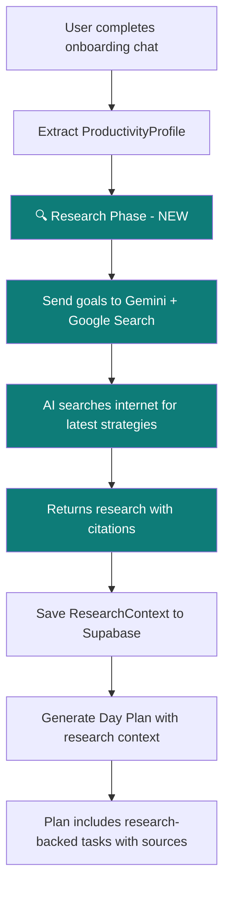

# Research-Backed AI Plan Generation

When a user tells the AI their long-term goal (e.g., "I want to crack GATE this year"), the current system generates a **generic** plan based only on what the AI already knows. The goal is to make the AI **search the internet** in the background to find the latest resources, strategies, study plans, etc., and incorporate that real-world research into a much smarter, more actionable daily plan.

## User Review Required

> [!IMPORTANT]
> **The `google_generative_ai` Dart SDK (v0.4.7) does NOT support Google Search grounding natively.** It only supports function calling and code execution tools. To use Gemini's built-in Google Search grounding, we need to make **direct REST API calls** to the `v1beta` endpoint. This means adding the `http` package as a dependency.

> [!WARNING]
> **Grounding with Google Search has billing implications.** Each search query the model executes is billable. For Gemini 2.5 models, billing is per-prompt. Ensure your API key has the appropriate quota. The free tier may have limited grounding support.

> [!IMPORTANT]
> **Compliance requirement:** When using Grounding with Google Search, Google requires you to display search suggestions (source citations) in the UI. We'll need to show users where the plan recommendations came from.

## Open Questions

1. **Which Gemini model for grounding?** The docs show `gemini-3-flash-preview` for grounding. Your current code uses `gemini-2.5-flash`. Should we use `gemini-2.5-flash` (which supports grounding) or upgrade to a newer model for research calls?
2. **When should research happen?** Options:
   - **(A) During onboarding** — After profile extraction, before plan generation (adds ~5-10s to onboarding)
   - **(B) During plan generation** — Every time a plan is generated/regenerated (adds latency each time)
   - **(C) Separate "Research" step** — User explicitly triggers a "Research my goals" action
   - I'd recommend **(A)** — do it once during onboarding as a batch, then cache the research in Supabase.
3. **Research depth:** Should the AI research each annual goal separately, or send all goals in one grounded query? Separate queries = better depth but more API calls/cost.

## Proposed Changes

### Architecture Overview



---

### Core AI Layer — New Grounded Search Service

#### [NEW] [grounded_search_service.dart](file:///Users/adityadas/StudioProjects/todoey_flutter/lib/core/ai/grounded_search_service.dart)

A new service that makes **direct REST API calls** to the Gemini `v1beta` endpoint with `google_search` tool enabled. This bypasses the `google_generative_ai` SDK limitation.

**Key responsibilities:**
- Call Gemini REST API with `tools: [{"google_search": {}}]`
- Parse the `groundingMetadata` from the response (search queries, citations, source URLs)
- Return structured `ResearchContext` containing:
  - Research insights per goal (latest strategies, resources, recommended timelines)
  - Source citations (URLs + titles) for transparency
  - Suggested daily activities based on real-world best practices

**The prompt will be something like:**
```
Given the user's goals: [goals list]
Research the internet to find:
1. The best current strategies and study plans for achieving each goal
2. Recommended resources (books, courses, tools) with specific names
3. Optimal daily time allocation based on expert recommendations  
4. Common mistakes to avoid
5. Weekly milestone suggestions based on proven approaches

Return as structured JSON with citations.
```

---

### Data Models

#### [NEW] [research_context.dart](file:///Users/adityadas/StudioProjects/todoey_flutter/lib/core/models/research_context.dart)

New model to hold the AI's research findings:
```dart
class ResearchContext {
  final List<GoalResearch> goalResearch;
  final List<Citation> citations;
  final DateTime researchedAt;
}

class GoalResearch {
  final String goal;
  final List<String> strategies;
  final List<String> resources;        // "Book: Atomic Habits", "Course: MIT OCW 6.006"
  final List<String> dailyActions;     // Actionable daily items
  final String recommendedTimePerDay;  // "2-3 hours"
  final List<String> weeklyMilestones;
  final List<String> commonMistakes;
}

class Citation {
  final String title;
  final String url;
}
```

---

### Data Layer

#### [NEW] [research_repository.dart](file:///Users/adityadas/StudioProjects/todoey_flutter/lib/core/data/research_repository.dart)

Repository to persist research context in Supabase so we don't re-research every time:
- `saveResearch(ResearchContext)` — saves to a `goal_research` table
- `loadResearch()` — loads cached research for the current user
- `isResearchStale()` — returns true if research is older than 7 days (configurable)

> [!NOTE]
> This requires a new Supabase table: `goal_research` with columns: `id`, `user_id`, `research_data` (JSONB), `created_at`, `updated_at`.

---

### Modified Plan Generation

#### [MODIFY] [plan_generation_service.dart](file:///Users/adityadas/StudioProjects/todoey_flutter/lib/core/ai/plan_generation_service.dart)

Update `_buildPlanPrompt()` to **incorporate research context** into the plan prompt. Instead of just using the user's profile, the prompt will also include:
- Researched strategies and resources for each goal
- Recommended time allocations from expert sources
- Specific actionable tasks (not vague ones like "study math" but "Complete MIT OCW Lecture 3 on Algorithms")

The plan output will also include a new field per task:
```json
{
  "time": "9:00 AM",
  "title": "Algorithm practice — Sorting",
  "description": "Work through merge sort problems on LeetCode (based on GATE CSE syllabus 2025)",
  "category": "focus",
  "source": "Researched from GATE preparation guides",
  "resourceLink": "https://..."
}
```

---

### Onboarding Integration

#### [MODIFY] [onboarding_chat_bloc.dart](file:///Users/adityadas/StudioProjects/todoey_flutter/lib/features/onboarding/domain/onboarding_chat_bloc.dart)

Update `_onCreateProfile` to add a **research phase** between profile extraction and plan generation:

```
1. Extract profile ✓ (existing)
2. 🔍 Research goals via grounded search (NEW)
3. Save research context to Supabase (NEW)
4. Generate plan using profile + research (MODIFIED)
5. Save plan ✓ (existing)
```

Add new state fields to `OnboardingChatState`:
- `isResearching: bool` — to show a "Researching your goals..." loading state
- `researchProgress: String?` — e.g., "Searching for GATE preparation strategies..."

---

### UI Updates

#### [MODIFY] [generated_plan_screen.dart](file:///Users/adityadas/StudioProjects/todoey_flutter/lib/features/planner/presentation/generated_plan_screen.dart)

- Show **source citations** on research-backed tasks (small "📚 Source" chip that expands to show the URL)
- Add a "🔍 Re-research" button that triggers a fresh grounded search
- Show a "Research insights" section at the top summarizing what the AI found

#### [MODIFY] Onboarding completion UI

- Add a new loading step: "🔍 Researching the best strategies for your goals..." between profile creation and plan generation
- Show which goals are being researched in real-time

---

### Dependencies

#### [MODIFY] [pubspec.yaml](file:///Users/adityadas/StudioProjects/todoey_flutter/pubspec.yaml)

Add `http` package for direct REST API calls:
```yaml
dependencies:
  http: ^1.2.0
```

---

### Supabase Schema

#### [NEW] `goal_research` table

```sql
CREATE TABLE goal_research (
  id UUID DEFAULT gen_random_uuid() PRIMARY KEY,
  user_id UUID REFERENCES auth.users(id) NOT NULL,
  research_data JSONB NOT NULL,
  created_at TIMESTAMP WITH TIME ZONE DEFAULT NOW(),
  updated_at TIMESTAMP WITH TIME ZONE DEFAULT NOW(),
  UNIQUE(user_id)
);

ALTER TABLE goal_research ENABLE ROW LEVEL SECURITY;

CREATE POLICY "Users can read own research"
  ON goal_research FOR SELECT
  USING (auth.uid() = user_id);

CREATE POLICY "Users can insert own research"
  ON goal_research FOR INSERT
  WITH CHECK (auth.uid() = user_id);

CREATE POLICY "Users can update own research"
  ON goal_research FOR UPDATE
  USING (auth.uid() = user_id);
```

## Verification Plan

### Automated Tests
- Unit test `GroundedSearchService` with a mock HTTP client to verify:
  - Correct REST API payload construction (includes `google_search` tool)
  - Proper parsing of `groundingMetadata` from response
  - Graceful fallback when grounding fails (use regular AI generation)
- Unit test `ResearchContext` serialization/deserialization
- Integration test the full flow: profile → research → plan generation

### Manual Verification
- Complete onboarding with a specific goal like "I want to crack GATE CSE 2027"
- Verify the AI researches and returns specific, current resources (not generic advice)
- Check that the generated plan includes research-backed tasks with citations
- Verify research is persisted to Supabase and reused on subsequent plan loads
- Test the "Re-research" button triggers a fresh search
- Test fallback behavior when Google Search grounding is unavailable
