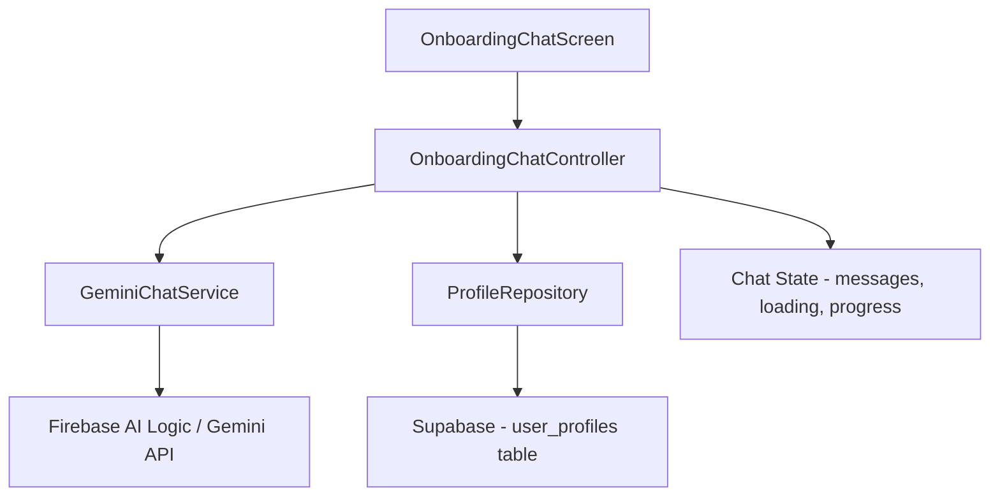

# AI Goal Conversation — Implementation Plan

## Current State

The `OnboardingChatScreen` exists but is fully **hardcoded** — scripted questions, pre-written answers, and a tap-to-advance flow. There is no AI involved. The goal is to replace this with a **real conversational AI experience** using **Firebase AI Logic with Gemini**.

## What Changes

| Area | Before | After |
|------|--------|-------|
| Questions | 6 hardcoded questions | AI generates contextual follow-ups |
| Answers | Pre-written, user taps "Send answer" | User types freely in a text field |
| Profile | Nothing saved | AI extracts structured profile → stored in Supabase |
| Progress | Fixed 6-step bar | Dynamic progress based on topics covered |
| Chat history | In-memory list | Multi-turn conversation via Gemini chat session |

---

## Architecture



### New Files to Create

```text
lib/
  core/
    ai/
      gemini_chat_service.dart       # Wraps Firebase AI Logic / Gemini SDK
      onboarding_system_prompt.dart  # System prompt for goal conversation
    models/
      productivity_profile.dart      # Dart model for structured profile data
      chat_message.dart              # Shared chat message model
  features/
    onboarding/
      data/
        profile_repository.dart      # Save/load profile to Supabase
      domain/
        onboarding_chat_controller.dart  # Business logic & state management
      presentation/
        onboarding_chat_screen.dart  # (rewrite) Real AI chat UI
        widgets/
          chat_bubble.dart           # Extracted chat bubble widget
          topic_progress_bar.dart    # Dynamic progress indicator
```

---

## Phase 1: AI Service Layer

### 1A. Add `firebase_ai` dependency

```yaml
# pubspec.yaml
dependencies:
  firebase_core: ^3.12.1
  firebase_ai: ^0.3.0
```

> **Important:**
> Firebase AI Logic (formerly Vertex AI for Firebase) requires:
> - A Firebase project linked to the Flutter app
> - `firebase_options.dart` generated via `flutterfire configure`
> - Gemini API enabled in the Firebase console

### 1B. `gemini_chat_service.dart`

Responsibilities:
- Initialize a Gemini **chat session** (multi-turn)
- Send user messages, receive AI responses
- At the end of the conversation, request a **structured JSON profile extraction**
- Handle errors gracefully (network, quota, content filtering)

Key design decisions:
- Use `startChat()` for multi-turn conversation so the model remembers context
- Use a **system instruction** to guide the AI's tone, topic coverage, and output format
- Keep the service stateless — the chat session lives in the controller

```dart
// Pseudocode shape
class GeminiChatService {
  late final GenerativeModel _model;

  void initialize() {
    _model = FirebaseAI.googleAI().generativeModel(
      model: 'gemini-2.0-flash',
      systemInstruction: Content.system(onboardingSystemPrompt),
    );
  }

  Chat startConversation() => _model.startChat();

  Future<String> sendMessage(Chat chat, String userMessage);

  Future<Map<String, dynamic>> extractProfile(Chat chat);
}
```

### 1C. System Prompt Design (`onboarding_system_prompt.dart`)

The system prompt is the **most critical piece**. It defines:

1. **Role**: You are an AI productivity coach onboarding a new user.
2. **Tone**: Friendly, concise, encouraging. No walls of text.
3. **Topic checklist** — the AI must cover these before finishing:
   - Yearly goals (career, health, learning, personal)
   - Monthly milestones that support annual goals
   - Ideal daily routine / habits
   - Wake time and sleep time
   - Focus windows (when they work best)
   - Weak hours / procrastination patterns
   - Distractions and triggers
   - Preferred coaching style (strict, gentle, motivational)
4. **Conversation rules**:
   - Ask **one topic at a time** — don't dump 5 questions at once
   - Acknowledge the user's response before moving on
   - If an answer is vague, ask a clarifying follow-up
   - After covering all topics, tell the user "I have everything I need" and signal completion
5. **Completion signal**: When all topics are covered, the AI should include a special marker like `[PROFILE_READY]` in its response so the app knows to enable the "Create profile" button.

> **Tip:**
> Keep the system prompt in a separate Dart constant file so it's easy to iterate on without touching service logic.

---

## Phase 2: Chat State Management

### `onboarding_chat_controller.dart`

Use a `ChangeNotifier` (or your preferred state management) to manage:

```dart
class OnboardingChatController extends ChangeNotifier {
  final GeminiChatService _aiService;
  final ProfileRepository _profileRepo;

  List<ChatMessage> messages = [];
  bool isLoading = false;
  bool isProfileReady = false;
  double progress = 0.0;  // 0.0 to 1.0

  late Chat _chat;

  /// Start the conversation — AI sends the first message
  Future<void> startConversation();

  /// User sends a message — AI responds
  Future<void> sendMessage(String text);

  /// Extract structured profile and save to Supabase
  Future<ProductivityProfile> createProfile();
}
```

**Progress tracking approach**:

The system prompt instructs the AI to include a hidden progress marker in each response, like:
```
[PROGRESS:4/8]
```
The controller parses this out (strips it from the displayed message) and updates the progress bar. This way progress is dynamic and driven by AI assessment of what topics have been covered.

Alternatively, a simpler approach: define 8 topics, and after each AI response, ask the model (via a lightweight side-call or by parsing the response) which topics have been covered.

> **Recommended**: Use the inline `[PROGRESS:x/y]` marker approach. It's simpler, doesn't require extra API calls, and the system prompt can reliably produce it.

---

## Phase 3: Data Models

### `productivity_profile.dart`

```dart
class ProductivityProfile {
  final List<String> annualGoals;
  final List<String> monthlyMilestones;
  final List<String> dailyHabits;
  final List<FocusWindow> focusWindows;
  final List<String> weakHours;
  final List<String> procrastinationTriggers;
  final String wakeTime;
  final String sleepTime;
  final String coachingTone;  // "strict", "gentle", "motivational"
  final List<String> recommendedAlarms;

  Map<String, dynamic> toJson();
  factory ProductivityProfile.fromJson(Map<String, dynamic> json);
}

class FocusWindow {
  final String startTime;
  final String endTime;
  final String label;  // e.g., "Deep work", "Exercise"
}
```

### `chat_message.dart`

```dart
class ChatMessage {
  final String text;
  final bool isUser;
  final DateTime timestamp;
}
```

### Profile Extraction

After the conversation is complete, the controller calls:
```dart
Future<ProductivityProfile> createProfile()
```

This sends a **final prompt** to the same chat session:
```
Based on our entire conversation, extract the user's productivity profile as JSON with this exact schema: { ... }
```

The AI returns structured JSON → parse into `ProductivityProfile` → save to Supabase.

> **Warning:**
> Always validate the JSON response. Gemini may occasionally return malformed JSON or wrap it in markdown code fences. The service should handle stripping ```json ``` wrappers and catching `FormatException`.

---

## Phase 4: Supabase Integration

### `profile_repository.dart`

```dart
class ProfileRepository {
  final SupabaseClient _client;

  /// Save the extracted profile for the current user
  Future<void> saveProfile(ProductivityProfile profile);

  /// Load existing profile (for returning users)
  Future<ProductivityProfile?> loadProfile();

  /// Save raw conversation history (optional, for re-extraction)
  Future<void> saveConversationHistory(List<ChatMessage> messages);
}
```

### Supabase Table: `user_profiles`

```sql
CREATE TABLE user_profiles (
  id UUID PRIMARY KEY DEFAULT gen_random_uuid(),
  user_id UUID REFERENCES auth.users(id) ON DELETE CASCADE,
  annual_goals JSONB,
  monthly_milestones JSONB,
  daily_habits JSONB,
  focus_windows JSONB,
  weak_hours JSONB,
  procrastination_triggers JSONB,
  wake_time TEXT,
  sleep_time TEXT,
  coaching_tone TEXT DEFAULT 'motivational',
  recommended_alarms JSONB,
  raw_conversation JSONB,
  created_at TIMESTAMPTZ DEFAULT now(),
  updated_at TIMESTAMPTZ DEFAULT now(),
  UNIQUE(user_id)
);

-- Row Level Security
ALTER TABLE user_profiles ENABLE ROW LEVEL SECURITY;

CREATE POLICY "Users can read own profile"
  ON user_profiles FOR SELECT
  USING (auth.uid() = user_id);

CREATE POLICY "Users can insert own profile"
  ON user_profiles FOR INSERT
  WITH CHECK (auth.uid() = user_id);

CREATE POLICY "Users can update own profile"
  ON user_profiles FOR UPDATE
  USING (auth.uid() = user_id);
```

---

## Phase 5: UI Rewrite

### Updated `OnboardingChatScreen`

The rewritten screen should have:

1. **Top**: `TopicProgressBar` — shows topics covered (dynamic from AI)
2. **Middle**: Scrollable chat with `ChatBubble` widgets — auto-scrolls to bottom on new messages
3. **Bottom input area**:
   - `TextField` for user to type freely
   - Send button (disabled while AI is responding)
   - When `isProfileReady == true`: show "Create profile" button instead of the text field

Key UX details:
- Show a typing indicator (animated dots) while waiting for AI response
- Auto-scroll to the latest message
- Disable input while AI is generating
- Handle errors with a retry option (e.g., "Couldn't reach AI. Tap to retry.")
- The AI sends the **first message** automatically when the screen opens

---

## Build Order

| Step | Task | Estimated Effort |
|------|------|------------------|
| 1 | Add Firebase Core + Firebase AI dependencies, run `flutterfire configure` | Setup |
| 2 | Create `chat_message.dart` model | Small |
| 3 | Create `onboarding_system_prompt.dart` with the full system prompt | Medium |
| 4 | Create `gemini_chat_service.dart` — multi-turn chat + profile extraction | Medium |
| 5 | Create `productivity_profile.dart` model with JSON serialization | Small |
| 6 | Create `onboarding_chat_controller.dart` with state management | Medium |
| 7 | Rewrite `onboarding_chat_screen.dart` with real text input, typing indicator, auto-scroll | Medium |
| 8 | Extract `chat_bubble.dart` and `topic_progress_bar.dart` widgets | Small |
| 9 | Create `user_profiles` table in Supabase with RLS | Setup |
| 10 | Create `profile_repository.dart` for Supabase CRUD | Small |
| 11 | Wire everything together and test end-to-end | Medium |

---

## Decisions (Resolved)

| Question | Decision |
|----------|----------|
| Firebase project | Create new project + run `flutterfire configure` |
| Gemini model | `gemini-2.0-flash` (free tier — 15 RPM, 1M tokens/min) |
| State management | **BLoC** (`flutter_bloc` + `equatable`) |
| Supabase table | Supabase already set up — SQL for `user_profiles` provided below |
| Save conversation | Yes — store raw chat alongside extracted profile |
| Firebase config | `firebase_options.dart` via `flutterfire configure` (standard approach) |

---

## Firebase Setup Guide (Step by Step)

### Step 1: Create Firebase Project

1. Go to [Firebase Console](https://console.firebase.google.com/)
2. Click **"Create a project"**
3. Name it something like `ai-productivity-coach`
4. Disable Google Analytics (optional, not needed for AI features)
5. Click **Create project**

### Step 2: Enable Gemini API

1. In Firebase Console, go to your new project
2. Navigate to **Build → AI Logic** (or search for "AI" in the left sidebar)
3. Click **Get Started**
4. This will enable the Gemini API for your project
5. Choose the **Google AI** backend (free tier, no billing required)

### Step 3: Install FlutterFire CLI

Run in terminal:
```bash
dart pub global activate flutterfire_cli
```

### Step 4: Configure Firebase in your Flutter app

Run from the project root:
```bash
flutterfire configure --project=your-firebase-project-id
```

This will:
- Register Android and iOS apps in Firebase
- Generate `lib/firebase_options.dart`
- Download `google-services.json` (Android) and `GoogleService-Info.plist` (iOS)

### Step 5: Add dependencies

```bash
flutter pub add firebase_core firebase_ai flutter_bloc equatable
```

### Step 6: Initialize Firebase in `main.dart`

```dart
import 'package:firebase_core/firebase_core.dart';
import 'firebase_options.dart';

Future<void> main() async {
  WidgetsFlutterBinding.ensureInitialized();
  await Firebase.initializeApp(options: DefaultFirebaseOptions.currentPlatform);
  // ... rest of init
}
```

---

## Supabase SQL: `user_profiles` Table

Run this in your Supabase SQL Editor:

```sql
CREATE TABLE user_profiles (
  id UUID PRIMARY KEY DEFAULT gen_random_uuid(),
  user_id UUID REFERENCES auth.users(id) ON DELETE CASCADE,
  annual_goals JSONB,
  monthly_milestones JSONB,
  daily_habits JSONB,
  focus_windows JSONB,
  weak_hours JSONB,
  procrastination_triggers JSONB,
  wake_time TEXT,
  sleep_time TEXT,
  coaching_tone TEXT DEFAULT 'motivational',
  recommended_alarms JSONB,
  raw_conversation JSONB,
  created_at TIMESTAMPTZ DEFAULT now(),
  updated_at TIMESTAMPTZ DEFAULT now(),
  UNIQUE(user_id)
);

ALTER TABLE user_profiles ENABLE ROW LEVEL SECURITY;

CREATE POLICY "Users can read own profile"
  ON user_profiles FOR SELECT
  USING (auth.uid() = user_id);

CREATE POLICY "Users can insert own profile"
  ON user_profiles FOR INSERT
  WITH CHECK (auth.uid() = user_id);

CREATE POLICY "Users can update own profile"
  ON user_profiles FOR UPDATE
  USING (auth.uid() = user_id);
```
